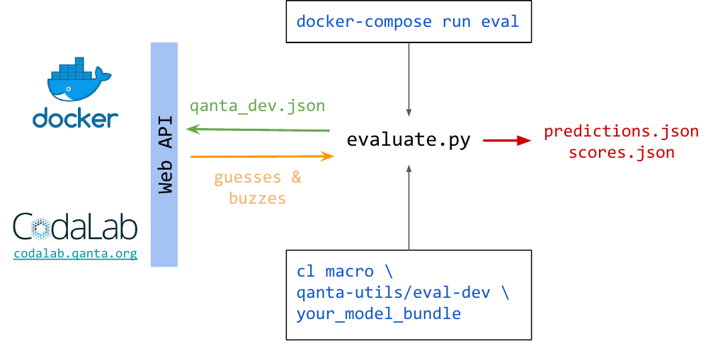

This is a simple use of the baseline system to answer questions from a web interface. 


## Input Format
In addition to the `question_text` field shown in the `httpie` sample request we provide a few additional fields.

 * `question_idx`: Question number in the current game.
 * `char_idx`: This corresponds on the server to `full_question[0:char_idx]` if `full_question` is the entire question.
 * `sent_idx`: The current sentence number.
 * `text` Question text up to `char_idx`
 
### Example

```json
{
  "question_idx": 0,
  "char_idx": 112,
  "sent_idx": 0,
  "text": "At its premiere, the librettist of this opera portrayed a character who asks for a glass of wine with his dying wish"
}
```


## Output Format
The output answer to each question is also a json object of two fields
 * `guess` Guessed Wikipedia answer entity
 * `buzz` true/false whether to buzz given the seen question text so far or not

### Example

```json
{"guess": "The_Marriage_of_Figaro", "buzz": true}
```


# Code Requirements

## Installation

You will  need to have [docker](https://docs.docker.com/install/), [elasticsearch](https://www.elastic.co/downloads/elasticsearch),  [docker-compose](https://docs.docker.com/compose/install/)
and [httpie](https://httpie.org) to test the web api.

## Running

To run the reference system we have provided four easy commands to run. All of
these commands use the utility `docker-compose` to do much of the heavy lifting
behind the scenes. Importantly it handles port forwarding and volume mapping so that:

* The directory `src/` is synced to `/src/` in the container
* The directory `data/` is synced to `/src/data` in the container
* The web api is accessible at `http://0.0.0.0:4861`
* The input web api is accessible at `http://localhost:5000`


## Commands

These commands are structured via `docker-compose CMD CONTAINER ARGS` where
`CMD` is a `docker-compose` command, `CONTAINER` is either `qb` or `eval`, and
`ARGS` runs inside of the container.

1. `docker-compose run qb ./cli download`: This will download the training data to `data/`. Add flag `--retrieve-paragraphs` to download retrieved Wikipedia paragraphs.

2. `docker-compose run qb ./cli train`: This will train a model and place it in `src/tfidf.pickle`

3. `docker-compose up`: This will start the web server in the foreground, `-d` for background, `ctrl-c` to stop

4. `python user_interface.py` This starts the website and is accessible at `http://localhost:5000`

5. `docker-compose run eval`: This will run the evaluation script

Another useful command is `docker-compose down` to shutdown zombied web servers
and scripts. `docker ps -a` will also display all running and stopped
containers. `docker-compose logs` will show all the container logs together.


### Test Web API (Command Line)
After you have run (1) and (2), you can test everything works by running

```bash
docker-compose up
```

And then the `httpie` command from before:

```bash
$ http POST http://0.0.0.0:4861/api/1.0/quizbowl/act text='Name the the inventor of general relativity and the photoelectric effect'

HTTP/1.0 200 OK
Content-Length: 41
Content-Type: application/json
Date: Wed, 10 Oct 2018 01:12:27 GMT
Server: Werkzeug/0.14.1 Python/3.7.0

{
    "buzz": false,
    "guess": "Albert_Einstein"
}
```

### Test Web API (Visual)
After you have run (1) and (2), you can test everything works by navigating to

`http://localhost:5000`

There should be a simple Question and Answer box that returns an answer, or the closest answer to the question when prompted. If an error is returned you may need to wait a little longer for elasticsearch to start up. 

### Batch Web API

WIP: More updates coming soon

GET URL: `/api/1.0/quizbowl/status`

Output:
```json
{
  "batch": true,
  "batch_size": 200,
  "ready": true
}
```


# Codalab

These instructions show you how to setup and run a codalab compatible model locally, but to submit to codalab you should follow the instructions at [codalab.qanta.org](http://codalab.qanta.org/).

The diagram below shows how Docker, codalab, and the evaluation scripts are related.



At a high level:
1. You submit your code/model for evaluation by running either the `docker-compose` command or the codalab macro.
2. Whichever way you submitted, the evaluation script assumes that running `src/run.sh` will start your web server
3. The evaluation script will run questions against the web API endpoint `/api/1.0/quizbowl/act`
4. The evaluation script will output your scores to the standard out locally, or post to the leaderboard when run on codalab.

## GPU

You may be interested in using a GPU in which case these instructions should help. We have prepared a GPU docker image, but there are several things which are different from the normal one. Here we assume you are on a machine with a GPU, and want to run docker locally.
1. On your local machine you need to have CUDA libraries installed. Installation is specific to OS and not covered here.
2. Install `nvidia-docker` which allows `docker` to use the host machine CUDA driver https://github.com/NVIDIA/nvidia-docker
3. Instead of `docker-compose` you'll need to use `docker-compose -f docker-compose-gpu.yml` which tells `docker` to use `entilzha/quizbowl-gpu` instead of `entilzha/quizbowl`. This image has the appropriate CUDA libraries installed.
4. To run you can use `nvidia-docker`, but this won't use the compose file we have provided. (Instructions untested here) you can use `nvidia-docker-compose` https://github.com/eywalker/nvidia-docker-compose as a workaround instead as described here https://hackernoon.com/docker-compose-gpu-tensorflow-%EF%B8%8F-a0e2011d36
5. When submitting to codalab we recommend you use start with the following parameters after the `cl macro` command `--request-gpus 1 --request-cpus 2 --request-memory 12g --request-docker-image entilzha/quizbowl-gpu`
6. Lastly, the image does not modify the base anaconda environment, but instead creates a new one named `qb`. For things to work you will need to run `source activate qb` at the top of `run.sh` and `cli` to switch to the new environment.
